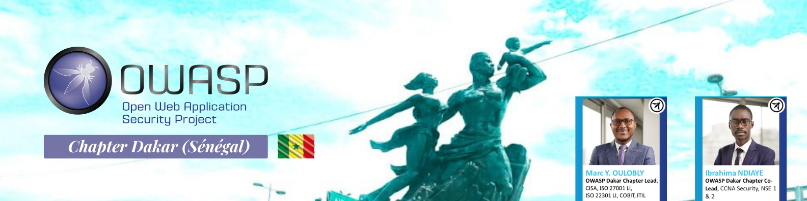

---

layout: col-sidebar
title: OWASP Dakar
tags: chapter-Dakar
region: Africa
meetup-group: null

---

 
## Welcome
Bienvenue sur la page d'accueil du chapitre Sénégalais  de L'OWASP.
Suivez l'actualité du chapitre su:

## Participation
The Open Web Application Security Project (OWASP) is a nonprofit foundation that works to improve the security of software. All of our projects ,tools, documents, forums, and chapters are free and open to anyone interested in improving application security. 

Chapters are led by local leaders in accordance with the [Chapters Policy](/www-policy/operational/chapters). Financial contributions should only be made online using the authorized online donation button. 

Everyone is welcome and encouraged to participate in our [Projects](/projects/), [Local Chapters](/chapters/), [Events](/events/), [Online Groups](https://groups.google.com/a/owasp.com/){:target='_blank'}, and [Community Slack Channel](https://owasp.slack.com/){:target='_blank'}. We especially encourage diversity in all our initiatives. OWASP is a fantastic place to learn about application security, to network, and even to build your reputation as an expert. We also encourage you to be [become a member](/membership/) or consider a [donation](/donate/) to support our ongoing work.

Next Meeting/Event <!-- You should keep this section as it will populate your meetup events -->
---------------------


